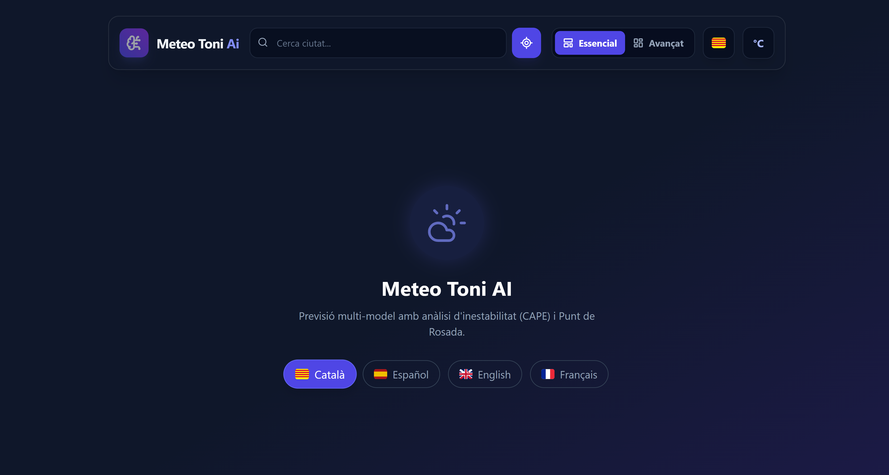

# 🌤️ MeteoToni AI (v2.5.0-PRO)

> **La previsió meteorològica de nova generació.**
> Una Progressive Web App (PWA) construïda amb React, Vite i TailwindCSS que fusiona models d'alta resolució (AROME) amb la potència de la Intel·ligència Artificial Generativa (Google Gemini) per oferir prediccions hiperlocalitzades i humanes.



## ✨ Característiques Principals

### 🧠 Intel·ligència Artificial (MeteoAI Gemini)
- **Anàlisi en Llenguatge Natural:** Utilitza **Google Gemini 1.5 Flash** per analitzar milers de dades meteorològiques i generar resums escrits en un to proper (i amb un toc d'humor local).
- **Consells Contextuals:** Recomanacions de roba ("vesteix per capes") i alertes de seguretat basades en la sensació tèrmica i fenòmens severs.
- **Fiabilitat:** Sistema de semàfors (Confiança Alta/Mitjana/Baixa) basat en la convergència dels models.

### 🗺️ Motor Meteorològic Híbrid
- **Fusió de Models:** Combina **ECMWF/GFS** (Global) amb **AROME HD** (Alta Resolució 1.3km) per a zones com Catalunya, Andorra i els Pirineus.
- **Dades en Temps Real:** Precipitació minut a minut, radar de pluja en viu i seguiment de tempestes.
- **Multimodel:** Comparativa visual entre GFS, ICON i ECMWF en gràfiques unificades.

### 🎨 Experiència d'Usuari (Glassmorphism 2.0)
- **Interfície Bento Grid:** Disseny modular, net i adaptatiu (Responsive) que organitza grans volums de dades sense aclaparar.
- **Mode Essencial vs. Expert:** L'usuari pot triar entre una vista simplificada o un tauler de control complet amb mètriques tècniques (CAPE, Cota de Neu, Punt de Rosada, etc.).
- **Visuals Immersius:** Fons dinàmics que canvien segons l'hora (alba, dia, capvespre, nit) i la condició climàtica, amb efectes de partícules.

### 📱 Progressive Web App (PWA)
- **Instal·lable:** Funciona com una app nativa a iOS i Android.
- **Offline First:** Estratègia de catxé robusta (`IndexedDB`) per consultar l'última previsió sense connexió.
- **Geo-Intel·ligència:** Cercador optimitzat amb suport per a noms en Català, Castellà, Anglès i Francès.

---

## 🛠️ Stack Tecnològic

- **Frontend:** React 18, TypeScript, Vite.
- **Estils:** TailwindCSS (amb efectes de vidre/blur avançats).
- **Gràfics i Mapes:** Recharts (gràfiques interactives), React-Leaflet (mapes de radar).
- **Iconografia:** Lucide React (icones vectorials netes).
- **IA:** Google Generative AI SDK.
- **Dades:** Open-Meteo API (font principal).
- **Deploy:** GitHub Pages (via GitHub Actions).

---

## 🚀 Instal·lació i Desenvolupament Local

1.  **Clonar el repositori:**
    ```bash
    git clone [https://github.com/tonitapias/meteoai.git](https://github.com/tonitapias/meteoai.git)
    cd meteoai
    ```

2.  **Instal·lar dependències:**
    ```bash
    npm install
    ```

3.  **Configurar Variables d'Entorn:**
    Crea un fitxer `.env` a l'arrel del projecte i afegeix la teva clau de l'API de Gemini:
    ```env
    VITE_GEMINI_API_KEY=la_teva_clau_api_de_google
    ```

4.  **Executar en local:**
    ```bash
    npm run dev
    ```
    Obre `http://localhost:5173` al teu navegador.

---

## 📦 Desplegament (GitHub Pages)

Aquest projecte està configurat per desplegar-se automàticament a GitHub Pages mitjançant **GitHub Actions**.

1.  Ves a **Settings > Secrets and variables > Actions** al teu repositori de GitHub.
2.  Crea un nou secret anomenat `VITE_GEMINI_API_KEY` amb la teva clau de Google AI.
3.  Fes un `push` a la branca `main` i l'acció s'executarà automàticament.

L'aplicació estarà disponible a: `https://tonitapias.github.io/meteoai/`

---

## 📂 Estructura del Projecte


```

src/
├── components/       # Components UI (Header, Widgets, Charts, etc.)
├── context/          # Gestió d'estat global (Preferències)
├── hooks/            # Custom Hooks (useWeather, useAI, useArome)
├── services/         # Connexió amb APIs externes i Cache
├── utils/            # Lògica de negoci, càlculs i formatadors
├── constants/        # Traduccions i configuracions estàtiques
└── App.tsx           # Component principal i layout

```

---

## 📄 Llicència i Crèdits

© 2024-2026 **MeteoAI Engineering**. All rights reserved.

- **Dades Meteorològiques:** [Open-Meteo API](https://open-meteo.com/) (Llicència CC BY 4.0).
- **Models:** AROME (Météo-France), GFS (NOAA), ICON (DWD), ECMWF.
- **Desenvolupament:** Toni Tapias.

---

<div align="center">
  <sub>Creat amb ❤️ i TypeScript a Catalunya.</sub>
</div>

```