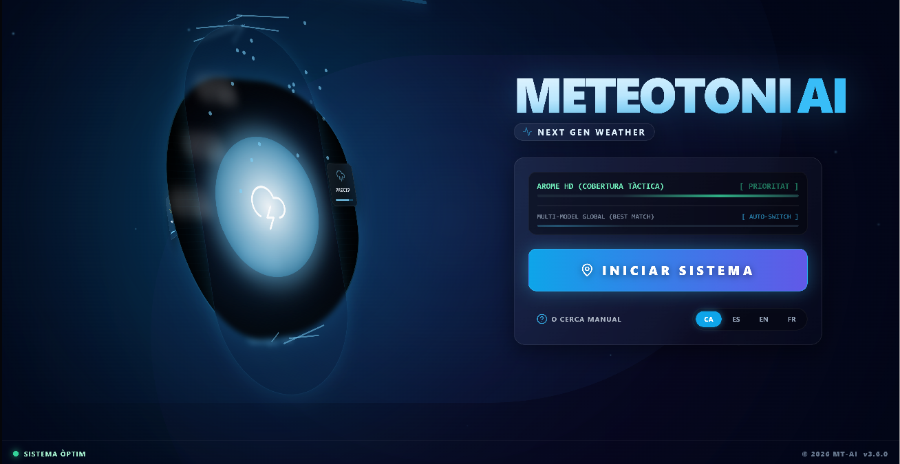
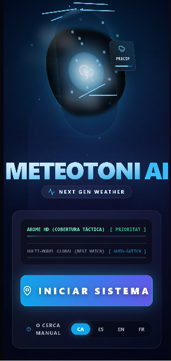
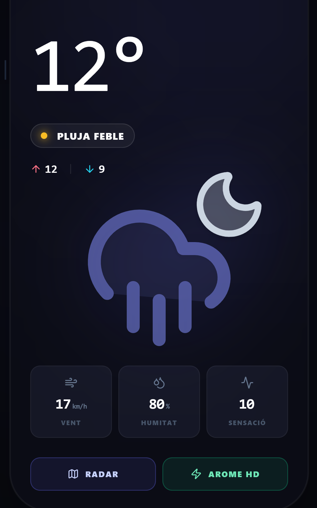

# ⚡ MeteoToni AI - Tactical Atmospheric Operating System

[](https://reactjs.org/)
[](https://vitejs.dev/)
[](https://www.typescriptlang.org/)
[](https://tailwindcss.com/)
[](https://deepmind.google/technologies/gemini/)
[]()
[]()

> **La meteorologia de precisió es troba amb l'enginyeria tàctica de software.**

MeteoToni AI no és una simple aplicació del temps; és un **sistema de telemetria meteorològica d'alta precisió** dissenyat per operar en condicions extremes i d'alta muntanya. Combina la potència predictiva de models globals amb la precisió topogràfica de models d'alta resolució, tot processat per una arquitectura tolerant a fallades i un motor d'Intel·ligència Artificial en temps real.

### ⚠️ Propòsit i Responsabilitat Operativa
MeteoToni AI és exclusivament una eina d'informació analítica. Proporciona dades basades en models matemàtics, **però les matemàtiques no eviten els riscos físics**. Aquesta aplicació no és un sistema de prevenció d'accidents, no detecta perills objectius sobre el terreny i no garanteix la seguretat en cap ruta. L'avaluació final de les condicions i la presa de decisions recau sempre, i de manera innegociable, en la formació, l'experiència visual i el criteri de l'usuari sobre el terreny.

---

## ✨ Visió General de la Interfície (Spatial UI)

<div align="center">
  
  <p><em>El HUD Tàctic (Head-Up Display) amb disseny Spatial UI i Neo-Skeuomorfisme, mostrant telemetria avançada i diagnòstics de sistema.</em></p>
</div>

<br/>

<div align="center" style="display: flex; justify-content: center; gap: 20px;">
  
  
</div>
<div align="center">
  <p><em>Esquerra: Previsió horària d'alta resolució AROME HD. Dreta: Consensus Widget analitzant discrepàncies entre models.</em></p>
</div>

---

## 🛡️ Pilars Arquitectònics

### 1. La Doctrina "Risc Zero" (Fiabilitat de Codi)
Aquest concepte s'aplica estrictament a l'**estabilitat del software**. En entorns complexos, necessites que la teva eina de dades no et deixi penjat ni et menteixi. El projecte està construït sota una arquitectura innegociable de tolerància a fallades tècniques:
* **Zero Falsos Positius:** Si l'API perd connexió, es mostren estats de `[ SENSOR STANDBY ]`. Mai s'imprimeixen dades numèriques nul·les (`0 km/h`) que puguin portar a una mala interpretació de la situació.
* **Validació Estricta (Zod):** Tot el trànsit de xarxa que entra al sistema és validat amb esquemes geomètrics estrictes abans de tocar la interfície visual.
* **Network Resilience:** Sistema natiu de re-intents (`fetchWithRetry`) i Timeouts personalitzats per combatre la intermitència de cobertura.
* **Observabilitat Total:** Integració profunda amb `@sentry/react` per capturar excepcions silencioses i fallades de validació de dades a la capa de xarxa.

### 2. Motor de Consens Multi-Model
Per reduir l'impacte dels microclimes, l'aplicació no confia en una sola font. Creua en temps real:
* **Models Globals (ECMWF, GFS, ICON):** Analitzen l'atmosfera a gran escala per definir tendències i el pas de grans sistemes frontals.
* **Models d'Alta Resolució (WRF, AROME):** Apliquen un zoom extrem (fins a 1.3km) per entendre com l'orografia alterarà el flux de vent i la precipitació al punt exacte on ets.
* **Consensus Widget:** Un sistema heurístic que compara els models i assigna un % d'alineació. Si detecta *Divergència* (els models no es posen d'acord), emet un avís de baixa fiabilitat predictiva.

### 3. Disseny Visual: Spatial UI & Neo-Skeuomorfisme
Dissenyada sota el concepte de *Dark Dashboard* tàctic per facilitar la lectura ràpida sota qualsevol llum:
* **GPU Acceleration:** Ús intel·ligent de capes per crear hologrames 3D i separar visualment els nivells de profunditat.
* **Neo-Skeuomorfisme:** Informació presentada amb codis de colors funcionals (Verd=Òptim, Ambre=Avís) i estats lluminosos que imiten instrumentació física.
* **Smart Dictionary (i18n):** Interfície totalment desacoblada per garantir canvis d'idioma autònoms en estat offline.

---

## ⚙️ Arquitectura Tècnica (Under the Hood)

Una mirada ràpida a l'auditoria de producció:

| Capa | Tecnologia | Detalls d'Implementació Clau |
| :--- | :--- | :--- |
| **Frontend Core** | React 19 + TypeScript | Tipat estricte (sense `any`), Hooks personalitzats i protecció de nuls. |
| **Build Tool** | Vite 6 | Configuració optimitzada per a PWA i compilació ultraràpida. |
| **Estils** | Tailwind CSS | Sistema utilitari (*Glassmorphism*, animacions CSS natives, mobile-first). |
| **Protecció API** | Zod + Sentry | Interceptors tipats (Mur de Contenció) per evitar caigudes de UI per dades corruptes. |
| **Gestió d'Estat** | Context API + IDB | Memòria cau persistent (`idb-keyval`) per a funcionament offline-first. |
| **Dades Externes** | Open-Meteo API | Orquestració asíncrona de múltiples models atmosfèrics en paral·lel. |
| **Intel·ligència** | Gemini AI | Integració via Proxy per a narratives descriptives adaptades al relleu local. |

---

## 🛠️ Instal·lació Local

1.  **Clona el repositori:**
    ```bash
    git clone [https://github.com/ToniTapias/meteoai.git](https://github.com/ToniTapias/meteoai.git)
    cd meteoai
    ```

2.  **Instal·la les dependències:**
    ```bash
    npm install
    ```

3.  **Configura l'entorn:**
    Crea un fitxer `.env` a l'arrel de l'aplicació. Has de configurar el servidor intermediari per a l'API de Gemini:

    ```env
    # URL del teu Proxy per a l'API de Gemini (OBLIGATORI)
    VITE_PROXY_URL=[https://la-teva-url-del-proxy.com/api/chat](https://la-teva-url-del-proxy.com/api/chat)
    
    # Temps d'espera per a les peticions a l'API (OPCIONAL, per defecte 10000ms)
    VITE_API_TIMEOUT=10000
    ```

4.  **Auditoria de Codi:**
    Valida la integritat estructural del codi abans d'executar:
    ```bash
    npm run type-check   # Executa el compilador TS per caçar errors de tipatge
    npm run lint         # Revisa les regles d'estil
    ```

5.  **Arranca el servidor de desenvolupament:**
    ```bash
    npm run dev
    ```

---

## 📄 Llicència i Crèdits

* Desenvolupat amb passió i enginyeria de precisió per **Toni Tapias** - © 2026.
* Llicència MIT.
* Dades meteorològiques proporcionades per [Open-Meteo](https://open-meteo.com/) sota llicència Creative Commons.
* IA impulsada per Google Gemini.

---
<div align="center">
  <p><em>La meteo no perdona; el codi, tampoc.</em> 🏔️⚡</p>
</div>