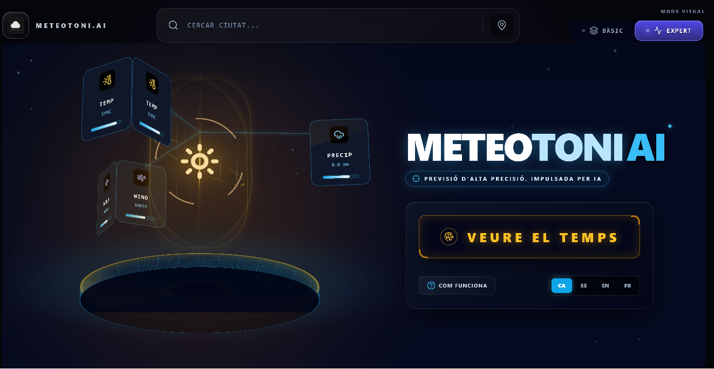
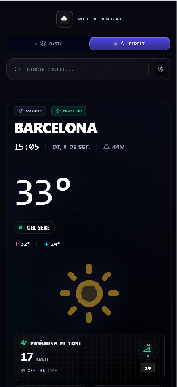
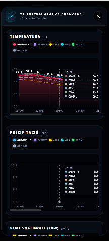

# ⚡ MeteoToni AI - Previsió Meteorològica d'Alta Precisió

[](https://reactjs.org/)
[](https://vitejs.dev/)
[](https://www.typescriptlang.org/)
[](https://tailwindcss.com/)
[](https://deepmind.google/technologies/gemini/)
[]()
[]()

> **Previsió meteorològica d'alta precisió, combinant models globals, model d'alta resolució i intel·ligència artificial.**

MeteoToni AI combina la potència predictiva dels models meteorològics globals amb la precisió topogràfica del model d'alta resolució AROME (fins a 1.3km), tot processat per un motor d'intel·ligència artificial en temps real per oferir-te la previsió més precisa possible allà on siguis.

### ⚠️ Propòsit i Limitacions
MeteoToni AI és exclusivament una eina d'informació analítica. Proporciona dades basades en models matemàtics, **però les matemàtiques no eviten els riscos físics**. Aquesta aplicació no és un sistema de prevenció d'accidents, no detecta perills objectius sobre el terreny i no garanteix la seguretat en cap ruta. L'avaluació final de les condicions i la presa de decisions recau sempre, i de manera innegociable, en la formació, l'experiència visual i el criteri de l'usuari sobre el terreny.

---

## ✨ Visió General de la Interfície (Spatial UI)

<div align="center">
  
  <p><em>El tauler principal (HUD) amb disseny Spatial UI i Neo-Skeuomorfisme, mostrant telemetria meteorològica i diagnòstics de sistema.</em></p>
</div>

<br/>

<div align="center" style="display: flex; justify-content: center; gap: 20px;">
  
  
</div>
<div align="center">
  <p><em>Esquerra: Previsió horària d'alta resolució AROME HD. Dreta: Consensus Widget analitzant discrepàncies entre models.</em></p>
</div>

---

## 🛡️ Pilars Arquitectònics

### 1. La Doctrina "Risc Zero" (Fiabilitat de Codi)
Aquest concepte s'aplica estrictament a l'**estabilitat del software**. En entorns complexos, necessites que la teva eina de dades no et deixi penjat ni et menteixi. El projecte està construït sota una arquitectura innegociable de tolerància a fallades tècniques:
* **Zero Falsos Positius:** Si l'API perd connexió o no hi ha dades disponibles, l'app mostra un estat explícit de "sense dades" en lloc de xifres. Mai s'imprimeixen dades numèriques nul·les (`0 km/h`) que puguin portar a una mala interpretació de la situació.
* **Validació Estricta (Zod):** Tot el trànsit de xarxa que entra al sistema és validat amb esquemes estrictes abans de tocar la interfície visual.
* **Network Resilience:** Sistema de re-intents i timeouts personalitzats per combatre la intermitència de cobertura.
* **Observabilitat Total:** Integració profunda amb `@sentry/react` per capturar excepcions silencioses i fallades de validació de dades a la capa de xarxa.

### 2. Motor de Consens Multi-Model
Per reduir l'impacte dels microclimes, l'aplicació no confia en una sola font. Creua en temps real:
* **Models Globals (ECMWF, GFS, ICON):** Analitzen l'atmosfera a gran escala per definir tendències i el pas de grans sistemes frontals; Open-Meteo selecciona automàticament el "Best Match" més fiable per a cada zona del planeta.
* **Model d'Alta Resolució (AROME):** Aplica un zoom extrem (fins a 1.3km) per entendre com l'orografia alterarà el flux de vent i la precipitació al punt exacte on ets. Disponible a la Península Ibèrica, França, els Pirineus i Europa Occidental; fora d'aquesta zona, l'app utilitza el consens dels models globals.
* **Consensus Widget:** Compara el model local amb el consens dels models globals i indica el nivell de fiabilitat de la previsió —consens, divergència o incertesa— per a temperatura, vent i pluja.
* **Avís de Canvi Sobtat (3h):** Si el model global o el model d'alta resolució AROME preveu pluja forta o vent fort en les properes tres hores, el Consensus Widget ho marca amb un avís visual explícit, encara que la situació actual sigui tranquil·la — AROME hi aporta la sensibilitat necessària per detectar convecció local que el model global sol allisar.

### 3. Disseny Visual: Spatial UI & Neo-Skeuomorfisme
Dissenyada sota el concepte de *Dark Dashboard* per facilitar la lectura ràpida sota qualsevol llum:
* **GPU Acceleration:** Ús intel·ligent de capes per crear hologrames 3D i separar visualment els nivells de profunditat.
* **Neo-Skeuomorfisme:** Informació presentada amb codis de colors funcionals (Verd=Òptim, Ambre=Avís) i estats lluminosos que imiten instrumentació física.
* **Smart Dictionary (i18n):** Interfície totalment desacoblada per garantir canvis d'idioma autònoms en estat offline.

---

## ⚙️ Arquitectura Tècnica (Under the Hood)

Una mirada ràpida a l'auditoria de producció:

| Capa | Tecnologia | Detalls d'Implementació Clau |
| :--- | :--- | :--- |
| **Frontend Core** | React 19 + TypeScript | Tipat estricte (sense `any`), Hooks personalitzats i protecció de nuls. |
| **Build Tool** | Vite 6 | Configuració optimitzada per a PWA i compilació ultraràpida. |
| **Estils** | Tailwind CSS | Sistema utilitari (*Glassmorphism*, animacions CSS natives, mobile-first). |
| **Protecció API** | Zod + Sentry | Interceptors tipats (Mur de Contenció) per evitar caigudes de UI per dades corruptes. |
| **Gestió d'Estat** | Context API + IDB | Memòria cau persistent (`idb-keyval`) per a funcionament offline-first. |
| **Dades Meteorològiques** | Open-Meteo API | Orquestració dels models globals (ECMWF, GFS, ICON, Best Match) i del model d'alta resolució AROME. |
| **Radar i Satèl·lit** | RainViewer + EUMETSAT | Radar Doppler i imatge satèl·lit (Meteosat, GOES, Himawari), servits per un proxy propi en Cloudflare Workers amb caché. |
| **Intel·ligència** | Gemini AI (amb Groq de reserva) | Anàlisi de risc meteorològic via un Worker propi a Cloudflare; un tallafocs determinista sobreescriu la IA si les dades brutes indiquen més risc del que reporta. |

---

## 🛠️ Instal·lació Local

1.  **Clona el repositori:**
    ```bash
    git clone https://github.com/ToniTapias/meteoai.git
    cd meteoai
    ```

2.  **Instal·la les dependències:**
    ```bash
    npm install
    ```

3.  **Configura l'entorn:**
    Crea un fitxer `.env` a l'arrel de l'aplicació. Has de configurar el servidor intermediari per a l'API de Gemini:

    ```env
    # URL del teu Proxy per a l'API de Gemini (OBLIGATORI)
    VITE_PROXY_URL=https://la-teva-url-del-proxy.com/api/chat
    
    # Temps d'espera per a les peticions a l'API (OPCIONAL, per defecte 10000ms)
    VITE_API_TIMEOUT=10000
    ```

4.  **Auditoria de Codi:**
    Valida la integritat estructural del codi abans d'executar:
    ```bash
    npm run type-check   # Executa el compilador TS per caçar errors de tipatge
    npm run lint         # Revisa les regles d'estil
    ```

5.  **Arranca el servidor de desenvolupament:**
    ```bash
    npm run dev
    ```

---

## 📄 Llicència i Crèdits

* Desenvolupat per **Toni Tapias**, amb col·laboració d'intel·ligència artificial — vegeu [CONTRIBUTORS.md](./CONTRIBUTORS.md) per als detalls. © 2026.
* Llicència MIT.
* Dades meteorològiques proporcionades per [Open-Meteo](https://open-meteo.com/) sota llicència Creative Commons.
* Radar per [RainViewer](https://www.rainviewer.com/) i imatge satèl·lit d'EUMETSAT.
* IA impulsada per Google Gemini, amb Groq com a sistema de reserva.

---
<div align="center">
  <p><em>Previsió meteorològica de precisió, allà on siguis.</em> 🌤️</p>
</div>
